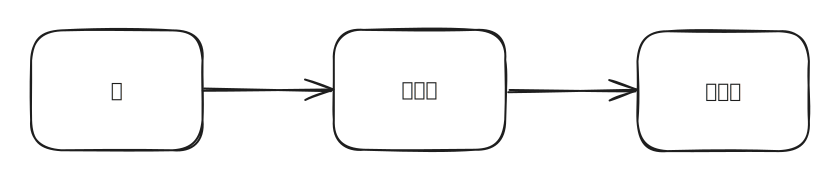

# 계층형 아키텍처의 문제점

## 계층형 아키텍처

* 장점
  * 각 계층별로 독립적인 로직을 작성할 수 있다.
  * 각 계층별로 원하는 기능을 추가하거나 확장할 수 있다.


계층형 아키텍처는 데이터베이스 주도 설계를 유발한다.\
웹은 도메인에, 도메인은 영속성에 의존하기 때문에, 결국 데이터베이스에 의존적이게 될 수 밖에 없는 구조이다.



비즈니스 규칙을 먼저 설계해야한다.

설계한 비즈니스 규칙을 기반으로 영속성 계층과 웹 계층을 만들어야 한다.


***

## 잘못된 접근


* 도메인 계층에서 영속성 계층의 <mark style="color:yellow;">엔티티</mark>를 사용하는경우
  * 도메인 로직뿐 아니라 <mark style="color:yellow;">즉시로딩, 지연로딩, 트랜잭션, 캐시 플러시</mark> 등등 영속성 계층과 관련된 작업들이 추가될 수 있다.


***


* 도메인 계층과 영속성 계층에서 접근하기위해 컴포넌트를 영속성 계층과 같은 아래 계층으로 내리는 경우
  * 시간이 지날수록 영속성 계층이 비대해진다.


***


* 도메인 계층을 건너뛰고, 웹 계층에서 영속성 계층에 의존하는 경우
  * 도메인 로직이 웹 계층에 구현된다.
  * 테스트할 때 서비스 계층뿐 아니라 영속성 계층도 mocking 해야한다.
    * 단위 테스트 복잡성 증가
    * 테스트 작성 난이도가 올라가면, 테스트를 자연스레 작성하지 않게 된다.


***

* 계층형 아키텍처는 도메인 서비스의 '너비'에 대한 규칙을 강제하지 않는다.
  * 여러 웹 컨트롤러에서 같은 서비스를 바라볼 수 있다.
* UserService 보다는 RegisterUserService 를 찾는게 더 쉬울 수 있다는 생각을 해봐야한다.
* 계층형 아키텍처에서 한명은 서비스 계층을, 한명은 영속성 계층을 분업해서 작업하기는 어려울 수 있다.
  * 한명이 영속석, 서비스, 웹 계층까지 모두 작업해야한다.

