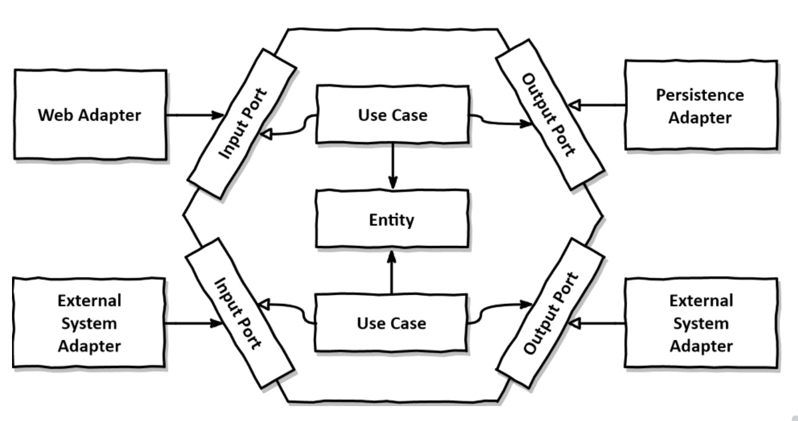

# 의존성 역전

## 단일책임원칙(SRP)

> 컴포넌트를 정의하는 이유는 오직 하나뿐이어야 한다.

## 의존성 역전 원칙(DIP)

> 코드상의 어떤 의존성이든 그 방향을 바꿀 수(역전시킬 수) 있다.

영속성 계층이 변경되면, 도메인 계층 또한 변경해야한다.

도메인 로직은 중요한 계층이므로 함부로 영향을 받아서는 안된다.

## 헥사고날 아키텍처

* 도메인 계층의 외부 의존성을 제거하고 UI, 데이터베이스등 인프라영역과 완전히 분리시킨다.
  * 웹 어댑터, 영속성 어탭더 등 다양한 외부 어댑터들이 존재한다.
* 이 과정에서 영속성 계층에서 사용하는 엔티티와 도메인 계층에서 사용하는 엔티티를 완전히 분리해야할 수 있다.(ex JPA Entity 와 순서 자바 도메인 객체의 분리)

<figure><figcaption>
헥사고날 아키텍처
</figcaption></figure>


중요한 점은 <mark style="color:yellow;">의존성을 역전</mark>시켜 도메인 로직의 결합을 제거하고, <mark style="color:yellow;">코드의 변경할 이유의 수를 줄이는 것</mark>이다.

이를 통해 유지보수성을 높일 수 있다.


